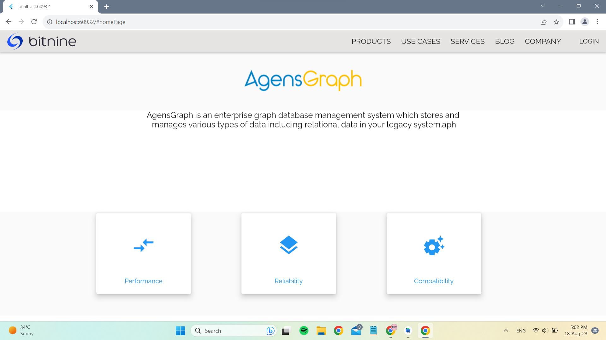
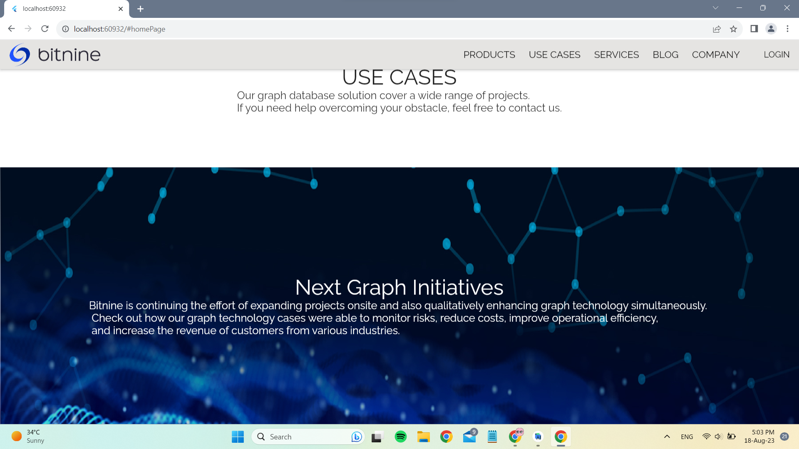
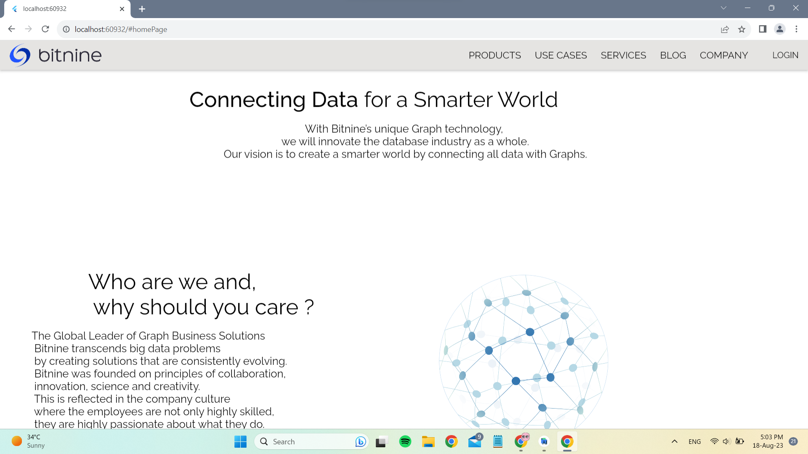
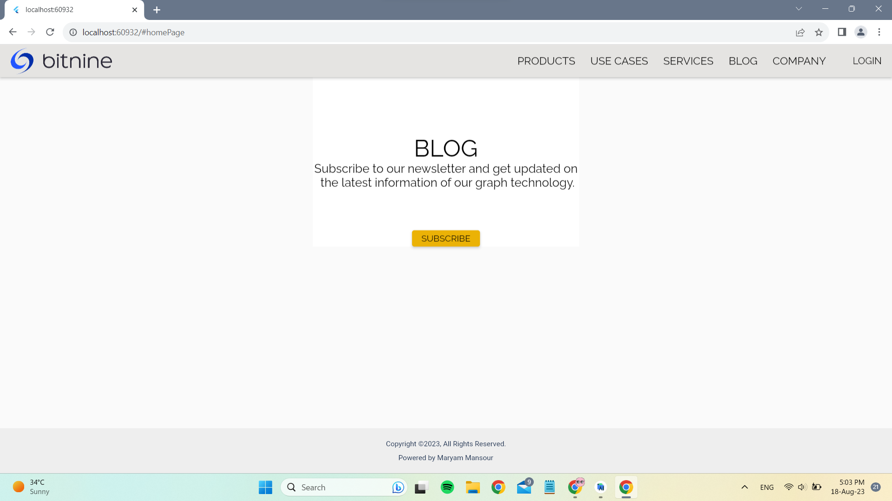
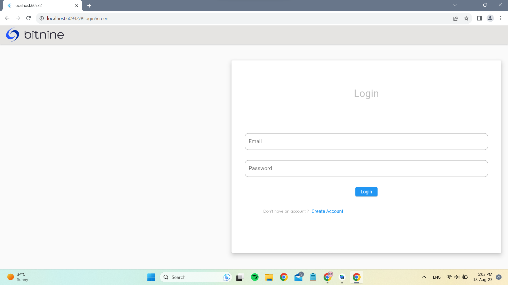
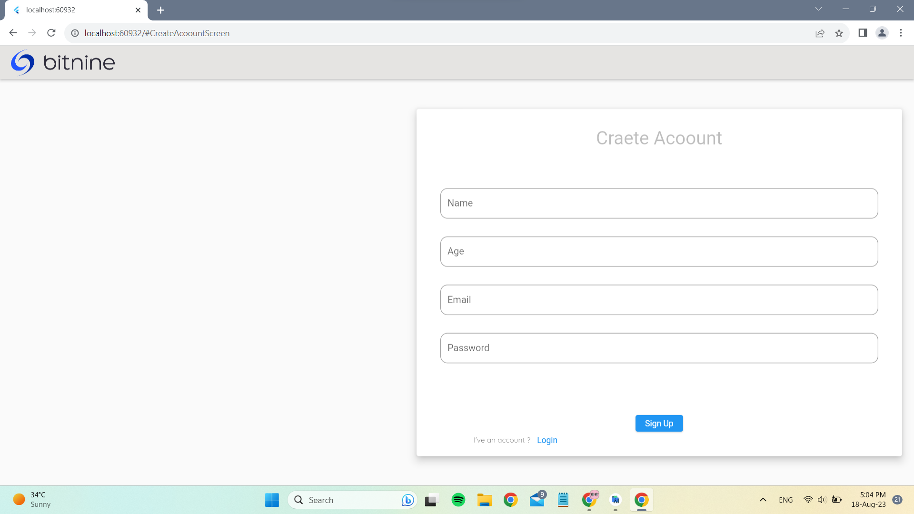

**My Web Project**
Overview
This web project is a dynamic website that displays content and allows users to sign up and log in using Firebase authentication. The website uses a cloud database provided by Firebase to store data, and is built using the MVVM architecture.

**Features**
Firebase Authentication: Users can sign up and log in to the website using their email and password, or through third-party providers such as Google or Facebook.
Cloud Database: The website uses Firebase’s cloud database to store and retrieve data, allowing for real-time updates and seamless integration with the front-end.
MVVM Architecture: The website is built using the Model-View-ViewModel (MVVM) architecture, which separates the user interface from the underlying data and logic, making it easier to maintain and scale.

**Technologies Used**
-Firebase Authentication

-Firebase Cloud Database

-MVVM Architecture

-Flutter Framework

**How to Use**
-Sign up for an account or log in using an existing account.

-Browse the content and interact with the website as desired.

**Future Development**
-Mobile App: Since this project is built using Flutter, it can easily be developed into a mobile app for iOS and Android devices.

-Firebase Hosting: The website can be deployed using Firebase’s hosting service, which provides fast and secure hosting for web apps.

##  Screenshots

Click to expand

### home Screen

